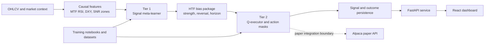

# AXE Genesis

**Signal intelligence, meta-learning, and paper-trading research for Alpaca.**

AXE Genesis is an experimental trading platform that combines causal market
features, multi-timeframe context, a signal meta-learner, and a Q-learning
execution layer behind a FastAPI service and React dashboard. It is built for
research and paper-account experimentation, not as production trading advice
or a guarantee of profitable or autonomous trading.

> **Status:** Research prototype. Use paper credentials only. Review every
> order path, risk control, and broker integration before considering any live
> deployment.

## Contents

- [What is implemented](#what-is-implemented)
- [Architecture](#architecture)
- [Quick start](#quick-start)
- [Configuration](#configuration)
- [API surface](#api-surface)
- [Training and evaluation](#training-and-evaluation)
- [Repository map](#repository-map)
- [Documentation map](#documentation-map)
- [Known limitations](#known-limitations)
- [Contributing](#contributing)
- [License](#license)

## What is implemented

| Area | Current state |
| --- | --- |
| FastAPI service | Implemented, with health, status, signal, logs, performance, and model routes. |
| React dashboard | Implemented dashboard views for autopilot, performance, and models. |
| Signal intelligence | Implemented causal feature generation, MTF RSI, DXY context, signal events, and support/resistance zones. |
| Meta-learning | Implemented synthetic training, checkpoint persistence, model registry, and evaluation workflows. |
| Q-executor | Experimental PyTorch/Keras learning and parity workflows; validate current checkpoints before use. |
| Alpaca integration | Paper-account client and execution paths exist, but remain prototype code and require independent review. |
| Live trading | Not supported or endorsed. |
| MCP orchestration | Planned/deferred; do not assume an MCP server is available. |

## Architecture



The backend is organized around a staged learning loop: generate causal
features, train or load the signal model, produce high-conviction transition
memories, evaluate the Q-executor, and expose results for monitoring. Broker
connectivity is an integration boundary; it does not make the research models
production-safe by itself.

## Quick start

### Prerequisites

- Python 3.10+ and the packages in `backend/requirements.txt`
- Node.js and npm for the dashboard
- Docker and Docker Compose for the PostgreSQL workflow
- Alpaca **paper** credentials only when using broker-backed endpoints

### Backend locally

```bash
cd backend
python3 -m venv .venv
source .venv/bin/activate
pip install -r requirements.txt
cp .env.example .env
python -m uvicorn app.main:app --host 0.0.0.0 --port 8000 --reload
```

Verify the service:

```bash
curl http://localhost:8000/health
curl http://localhost:8000/status
```

Interactive API documentation is available at
`http://localhost:8000/docs`; the OpenAPI document is at
`http://localhost:8000/openapi.json`.

### Frontend locally

In a second terminal:

```bash
cd frontend
npm install
npm run dev
```

The frontend is a Vite/TanStack React application. Set
`VITE_API_BASE_URL` when the backend is not running at its default URL:

```bash
VITE_API_BASE_URL=http://localhost:8000 npm run dev
```

### Docker Compose

From the repository root, the canonical Compose workflow starts PostgreSQL
and the backend on port `8000`:

```bash
docker compose up --build
```

The root Compose file uses the root `.env` for overrides and creates the
`alpaca_agent` PostgreSQL database by default. Keep credentials in ignored
`.env` files; never commit them.

## Configuration

Copy [backend/.env.example](backend/.env.example) to `backend/.env` and set
the values required for your workflow. Important settings include:

- `DATABASE_URL` for SQLite or PostgreSQL persistence
- `ALPACA_API_KEY`, `ALPACA_SECRET_KEY`, and `ALPACA_BASE_URL`
- `AGENT_LOOP_ENABLED` and `AGENT_LOOP_INTERVAL_SECONDS`
- `MARKET_SYMBOLS`, `MARKET_TIMEFRAME`, and `MARKET_LOOKBACK_BARS`
- `LEARNER_CHECKPOINT_VERSION` and `LEARNER_SCOPE`

Generated datasets, logs, checkpoints, model weights, and archives are
ignored by Git. See [.gitignore](.gitignore) before adding artifacts.

## API surface

The running FastAPI application is the authoritative API reference. The main
route groups are:

| Group | Routes | Purpose |
| --- | --- | --- |
| Health | `GET /health`, `GET /status` | Service and broker status |
| Agent | `POST /agent/start`, `/agent/stop`, `/agent/run-cycle` | Agent controls and manual cycles |
| Signals | `GET /signal/latest`, `POST /signal/bundle` | Signal inspection and generation |
| Monitoring | `GET /logs`, `/positions`, `/performance/summary`, `/performance/trades` | Operational and performance views |
| Models | `GET /models`, `POST /models/pretrain`, `POST /models/{id}/activate`, `DELETE /models/{id}` | Registry and checkpoint lifecycle |
| Training | `POST /meta-learner/train-synthetic`, `GET /meta-learner/runs`, `/sessions/{id}`, `/checkpoints` | Synthetic training and run history |

Treat control, order, and model-mutation routes as privileged operations. The
dashboard is a monitoring and experimentation client, not a risk guarantee.

## Training and evaluation

Run backend commands from `backend/` with the project environment active.

```bash
# Run the backend test suite
PYTHONPATH=. pytest tests/ -v --tb=short

# Evaluate PyTorch or Keras expiry workflows
PYTHONPATH=. python scripts/evaluate_option_expiries.py \
  --symbols SPY --framework pytorch --limit 40000
PYTHONPATH=. python scripts/evaluate_option_expiries.py \
  --symbols SPY --framework keras --limit 40000

# Inspect and manage registered model checkpoints
python scripts/manage_meta_models.py list
python scripts/manage_meta_models.py list --symbol AAPL
```

The maintained notebooks live in
[`notebooks/training`](notebooks/training) and
[`notebooks/kaggle`](notebooks/kaggle):

- [Signal-shaped RL training](notebooks/training/axe_signal_shaped_rl_training.ipynb)
- [Meta/Q learner synchronization](notebooks/training/axe_meta_q_learner_sync.ipynb)
- [PyTorch Kaggle bundle](notebooks/kaggle/axe_meta_learner_training_pytorch.ipynb)
- [Keras Kaggle bundle](notebooks/kaggle/axe_meta_learner_training_keras.ipynb)

Large datasets and model artifacts are local/generated inputs and are
intentionally excluded from the repository.

## Repository map

```text
.
├── backend/
│   ├── app/
│   │   ├── agent/                 # Scheduled signal and execution cycle
│   │   ├── axe_paka_v1/            # Prototype model/runtime integration
│   │   ├── core/
│   │   │   ├── analysis/           # Technical and support/resistance features
│   │   │   ├── market/             # MTF indicators, DXY, zones, signal events
│   │   │   ├── ml/                 # Meta-learning, datasets, registries
│   │   │   └── options/            # Options and Q-executor workflows
│   │   ├── db/                     # SQLAlchemy models and persistence
│   │   ├── main.py                 # FastAPI application and routes
│   │   └── utils/                  # Alpaca client and shared utilities
│   ├── scripts/                    # Training, evaluation, audit, and export CLIs
│   ├── tests/                      # Backend and model tests
│   ├── requirements.txt
│   └── Dockerfile
├── frontend/
│   ├── src/routes/                 # Dashboard, performance, and model views
│   ├── src/lib/                    # API and shared frontend utilities
│   └── package.json
├── notebooks/
│   ├── training/                   # Maintained training and parity notebooks
│   └── kaggle/                     # Generated PyTorch and Keras bundles
├── docs/                           # Architecture, strategy, API, and handover notes
├── data/                           # Ignored/generated datasets and logs
├── checkpoints/                    # Ignored/generated model checkpoints
├── docker-compose.yml              # Canonical local backend/PostgreSQL stack
├── .gitignore                      # Artifact and secret exclusions
└── README.md                       # This project entry point
```

## Documentation map

| Need | Read |
| --- | --- |
| System handoff and signal flow | [Signal intelligence handoff](docs/agent_handoff_signal_intelligence.md) |
| Competition architecture | [Competition signal architecture](docs/competition_signal_architecture.md) |
| Strategy and options design | [Strategy](docs/strategy.md) and [Alpaca execution/PnL notes](docs/alpaca_trade_execution_and_pnl_docs.md) |
| Frontend/API contract | [Frontend API contract and guide](docs/frontend_api_contract_and_guide.md) |
| Model lifecycle | [Model update workflow](docs/model_update_workflow.md) |
| Training architecture | [Q-learning architecture](Q_LEARNING_ARCHITECTURE.md) and [notebooks](notebooks/training) |
| First-run onboarding | [START_HERE.md](START_HERE.md) |

## Known limitations

- This is not production trading software and has no profitability guarantee.
- The execution path contains prototype assumptions and must be reviewed before
  any broker-backed use.
- Paper trading and model evaluation are not equivalent to live-market safety.
- Data, checkpoints, and training outputs are not reproducible from Git alone;
  acquire or generate the required local artifacts separately.
- The parity verifier currently has a known gradient-detach failure; see the
  test output before treating parity as complete.
- MCP orchestration, hardened risk controls, and a production deployment path
  remain planned work.

## Contributing

Keep changes focused and document new workflows beside the code that owns them.
Before opening a change, run the relevant backend tests or frontend checks and
update this README when setup commands, routes, or project ownership changes.
Do not commit credentials, generated datasets, checkpoints, or model weights.

## License

See [LICENSE](LICENSE).
<!-- audience:all -->
# Alpaca AI Trading Agent

An autonomous, options-focused trading agent built on Alpaca's paper-trading
platform for the **Alpaca AI Trading Agents Hackathon**
(https://lablab.ai/ai-hackathons/alpaca-ai-trading-agents-hackathon).

A two-tier signal + execution system: a meta-learner reads higher-timeframe
bias and SNR zone structure, a Q-learner executor decides money management,
entry timing, and risk on a lower timeframe — anchored to zones, confirmed by
volume, never chasing price.

**Jump to the section for you:** [Users](#for-users) ·
[Judges](#for-judges) · [AI agents](#for-ai-agents) · [Developers](#for-developers)

---

## For Users
<!-- audience:user -->

> This section describes the project once it's feature-complete. Some of this
> is still in progress — see [For Judges](#for-judges) for exact current status.

**What it does:** connects to your Alpaca paper-trading account and trades
options autonomously, using a directional bias read from higher-timeframe
support/resistance structure, executed only at confirmed zones with
volume-backed entries — never chasing a move that's already run.

**What you don't need to do:** click buy/sell, monitor charts, or manage
individual trades. The agent handles entries, sizing, exits, and stopping
itself out.

**What you do need:**
- An Alpaca account with a paper-trading account funded (simulated money —
  no real capital at risk)
- API keys from your Alpaca dashboard
- The backend running somewhere it can stay up during market hours (see
  [Developers](#for-developers) for hosting)

**Monitoring your agent:** the frontend dashboard shows current positions,
recent decisions, and P&L. It doesn't need to be open for the agent to keep
trading — it's just a window into what the backend is doing.

---


**Competition:** Alpaca AI Trading Agents Hackathon (lablab.ai × Alpaca),
28 Aug – 4 Sept 2026.

**Competition:** Alpaca AI Trading Agents Hackathon (lablab.ai × Alpaca),
28 Aug – 4 Sept 2026.

**Hard requirements and implementation status:**

| Requirement | Status | Architecture Details |
|---|---|---|
| Autonomous agent (Alpaca Trading API) | ✅ Complete | Scheduled execution loop, real-time bar fetching & DXY context alignment |
| Options trading as core strategy | ✅ Complete | Two-tier RL pipeline: Tier 1 Meta-Learner + Tier 2 Dual-Branch Q-Executor |
| Multi-Framework Parity | ✅ Complete | 1:1 functional parity across PyTorch (`q_executor.py`) and Keras (`keras_q_executor.py`) |
| Zero-Leakage Data Engine | ✅ Complete | Vectorized causal S&R detection (`df.iloc[:idx+1]`) & 0%-lookahead zone snapshots |
| DeepScalper Reward Shaping | ✅ Complete | Wise Patience (+0.15), Missed Opportunity (-0.45x, cap -1.50), Best Price Entry (+0.15) |
| Instrument Scaling Engine | ✅ Complete | Dynamic $0.01 pip scaling ($0.01 = 1 cent = 1 pip) for USD Equity & ETF universe |

---

## Architecture Overview — AXE Genesis Pipeline

The system uses a **Two-Tier Reinforcement Learning Pipeline**:

1. **Tier 1 — Signal Meta-Learner**:
   - Evaluates multi-horizon forward-looking price statistics (5m, 15m, 30m, 1h).
   - Features 6 decoupled auxiliary regression heads with private LayerNorm projections (`feat.detach()`).
   - Generates `HTFBiasPackage` containing signal strength score [0.0 - 1.0], reversal probability, expected MFE/MAE pips, and optimal expiry horizon index.

2. **Phase 1b — Meta-Learner Sequential Pass & 10k Transition Buffer**:
   - The Meta-Learner makes a sequential, causal pass over `train_df`.
   - Generates 10,000 high-conviction Q-Learner transition memories (filtered for meta strength $\ge 0.65$ or move $\ge 0.5\%$).
   - Pairs teacher oracle signals with `HardActionMask` to eliminate noise and train disciplined execution.

3. **Tier 2 — Dual-Branch Ensemble Q-Executor**:
   - Gated fusion layer combining microstructure features + MTF alignment.
   - 5-action space: `WAIT`, `BUY_CALL`, `BUY_PUT`, `TAKE_PROFIT_HALF`, `CLOSE_FLATTEN`.
   - Trained for 1,500 gradient steps (batch size 128) on the meta-generated 10k replay buffer.

4. **Hard Action Masking & Data Integrity**:
   - `HardActionMask` prevents price chasing at resistance/support levels and enforces buyer/seller volume profile confirmation.
   - Fallback volume-delta logic (`buy_volume >= sell_volume * 1.1` for CALLs, `sell_volume >= buy_volume * 1.1` for PUTs) prevents zero-trade evaluation deadlocks when explicit S&R zones are out of range.

---

## For AI agents
<!-- audience:ai -->

Quick orientation map for navigating this repo:

**Core execution path:**
- `backend/scripts/evaluate_option_expiries.py` — The primary cross-symbol out-of-sample walk-forward benchmark pipeline.
- `backend/app/core/options/q_executor.py` — PyTorch Dual-Branch Q-Executor implementation.
- `backend/app/core/options/keras_q_executor.py` — Keras Dual-Branch Q-Executor implementation.
- `backend/app/core/ml/instrument_metadata.py` — Dynamic underlying instrument metadata scaling engine ($0.01 = 1 cent = 1 pip for Equities/ETFs).
- `backend/app/core/market/zone_snapshot.py` — `ZoneSnapshotManager` and `HardActionMask` engine.
- `backend/app/core/analysis/support_resistance.py` — Vectorized 0%-lookahead SNR detection engine.
- `backend/scripts/generate_retro_charts.py` — Matplotlib retro 2D technical chart generator.
- `backend/scripts/build_slide_presentation.py` — ReportLab landscape 16:9 PDF presentation compiler.


**Conventions:** Python backend uses `requirements.txt` + venv (not poetry).
Frontend is Vite + React, not Next.js. `.env` is never committed — always
check `.env.example` for the current variable set before assuming one exists.

---

## For Developers
<!-- audience:developer -->

### Setup

```bash
# Backend
cd backend
python3 -m venv .venv
source .venv/bin/activate   # Windows: .venv\Scripts\activate
pip install -r requirements.txt
cp .env.example .env        # then fill in your Alpaca paper keys

# Frontend
cd ../frontend
npm install
cp .env.example .env
```

### Running

```bash
# Backend API (from backend/, venv active)
uvicorn app.main:app --reload

# Frontend dev server (from frontend/)
npm run dev

# Or via Docker Compose (from backend/)
docker-compose up
```

### Testing

```bash
cd backend
source .venv/bin/activate
PYTHONPATH=. pytest tests/ -v --tb=short
```

(Note: older docs in this repo reference a hardcoded path from a different
project — ignore those; use the venv-relative command above instead.)

### Structure

```
backend/
  app/
    agent/       — scheduled trading cycle
    api/         — (reserved for route modules)
    core/
      analysis/  — signal analysis
      data/      — data loading, synthetic data generation
      market/    — indicators, MTF RSI, SNR zones, DXY basket (FX)
      ml/        — meta-learner model, registry, training
      processing/— task/processing orchestration
      services/  — auth, caching, health, websockets, etc.
    db/          — SQLAlchemy models + connection
    utils/       — Alpaca API client
  tests/
  scripts/       — model management CLI
frontend/
  src/           — Vite + React dashboard
docs/            — strategy, competition brief, architecture directives
```

### Environment variables

See `.env.example` in both `backend/` and `frontend/`. Never commit `.env` —
it's in `.gitignore` already; keep it that way.

### Known issues to fix before relying on this for real trading

1. `alpaca_client.py` — missing `APCA-API-SECRET-KEY` header (auth is broken)
2. No options order construction (strike/expiry/right/multi-leg) exists yet
3. No MCP server or CLI integration — currently raw REST calls
4. `agent/loop.py` generates and logs signals but never executes trades

See `docs/options-repurposing-directives.md` for the plan to close these.