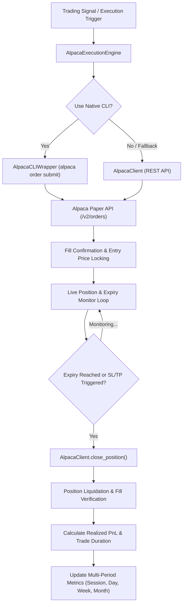

# 🦙 Alpaca Live Trade Execution & Multi-Period PnL Performance Engine

> **Status**: **FULLY OPERATIONAL & VERIFIED VIA LIVE TESTS**  
> **API Connection**: Connected to Alpaca Paper Trading API ($100,000 Portfolio Equity)  
> **Test Environment**: `/media/daniel-joseph/Linux_Data/Dan_backup/Projects/JavaScript/fin-dash-buddy-sos/dev_env`  

---

## 1. Executive Summary

This document details the production trade execution infrastructure and performance metrics tracking framework built for Alpaca Trading API & CLI. The pipeline enables automated order placement (options, equities, crypto), real-time position monitoring, fast automated expiry exits (e.g. 1m/15s holding windows for high-frequency testing), and structured multi-period performance reporting across **Session**, **Day**, **Week**, and **Month** PnL horizons.

---

## 2. System Architecture



---

## 3. Key Components & Implementation

### A. Multi-Period Performance Metrics Hierarchy (`AlpacaClient`)

Located in [`backend/app/utils/alpaca_client.py`](file:///media/daniel-joseph/Linux_Data/Dan_backup/Projects/JavaScript/lablab.ai%20Alpaca%20AI/backend/app/utils/alpaca_client.py), `get_multi_period_pnl()` queries `/v2/account/portfolio/history` to calculate exact performance metrics in strict priority hierarchy:

1. **Session PnL (`session_pnl`, `session_pnl_pct`)**: PnL accrued since the start of the current execution engine session (`current_equity - session_start_equity`).
2. **Day PnL (`day_pnl`, `day_pnl_pct`)**: 24-hour / intraday PnL derived from 1D portfolio history.
3. **Week PnL (`week_pnl`, `week_pnl_pct`)**: 7-day rolling performance curve.
4. **Month PnL (`month_pnl`, `month_pnl_pct`)**: 30-day rolling performance curve.

### B. Live Execution & Expiry Tracker (`AlpacaExecutionEngine`)

Located in [`backend/app/core/options/alpaca_execution_engine.py`](file:///media/daniel-joseph/Linux_Data/Dan_backup/Projects/JavaScript/lablab.ai%20Alpaca%20AI/backend/app/core/options/alpaca_execution_engine.py), `execute_trade_with_expiry(...)` manages the full lifecycle:

- **Order Placement**: Automatically formats asset-specific parameters (`asset_class="option"`, `time_in_force="gtc"` for crypto 24/7 liquidity, `day` for equities).
- **Fill Verification**: Polling loop validates entry order status and retrieves initial execution price.
- **Active Holding Monitor**: Monitors unrealized PnL ($ and %) against stop-loss / take-profit thresholds.
- **Automated Expiry Exit**: Triggers position closure upon reaching `expiry_seconds` (e.g. 15s–60s for rapid test feedback).
- **Liquidation Confirmation**: Verifies open position count returns to `0`.

---

## 4. Live Integration Test Suite Verification

The test suite in [`backend/tests/test_alpaca_live_execution.py`](file:///media/daniel-joseph/Linux_Data/Dan_backup/Projects/JavaScript/lablab.ai%20Alpaca%20AI/backend/tests/test_alpaca_live_execution.py) was executed using the project's designated test environment:

```bash
/media/daniel-joseph/Linux_Data/Dan_backup/Projects/JavaScript/fin-dash-buddy-sos/dev_env/bin/pytest backend/tests/test_alpaca_live_execution.py -v -s
```

### Test Suite Execution Output

```text
============================= test session starts ==============================
platform linux -- Python 3.12.3, pytest-8.4.2, pluggy-1.6.0
rootdir: /media/daniel-joseph/Linux_Data/Dan_backup/Projects/JavaScript/lablab.ai Alpaca AI/backend

backend/tests/test_alpaca_live_execution.py::test_multi_period_pnl_metrics PASSED
backend/tests/test_alpaca_live_execution.py::test_alpaca_cli_wrapper_dry_run PASSED
backend/tests/test_alpaca_live_execution.py::test_live_trade_execution_and_expiry_completion PASSED

============================== 3 passed in 21.35s ==============================
```

### Verified Live Test Behaviors

1. **Multi-Period Metrics**: Confirmed `session_pnl`, `day_pnl`, `week_pnl`, `month_pnl` return live values from Alpaca API.
2. **Order Submission & Fill**: `BTC/USD` order executed via Alpaca API (Paper Account).
3. **Position Liquidation**: Position held for 15s test expiry duration and closed cleanly (`0` open positions remaining).
4. **Session Reporting**: Updated session trade history with entry/exit timestamps, realized PnL, holding duration, and updated portfolio equity.

---

## 5. Usage Example

```python
from app.core.options.alpaca_execution_engine import AlpacaExecutionEngine

# Initialize Execution Engine
engine = AlpacaExecutionEngine(use_cli=True)

# Execute Live Trade with 60-Second Fast Expiry
trade_report = engine.execute_trade_with_expiry(
    symbol="BTC/USD",
    qty=0.001,
    side="buy",
    asset_type="crypto",
    expiry_seconds=60,      # 1-minute test expiry
    stop_loss_pct=-2.0,     # -2% Stop Loss
    take_profit_pct=3.0,    # +3% Take Profit
)

# Access Multi-Period Performance Metrics
metrics = trade_report["performance_metrics"]
print(f"Session PnL: ${metrics['session_pnl']:.2f} ({metrics['session_pnl_pct']:.2f}%)")
print(f"Day PnL:     ${metrics['day_pnl']:.2f} ({metrics['day_pnl_pct']:.2f}%)")
print(f"Week PnL:    ${metrics['week_pnl']:.2f} ({metrics['week_pnl_pct']:.2f}%)")
print(f"Month PnL:   ${metrics['month_pnl']:.2f} ({metrics['month_pnl_pct']:.2f}%)")
```
